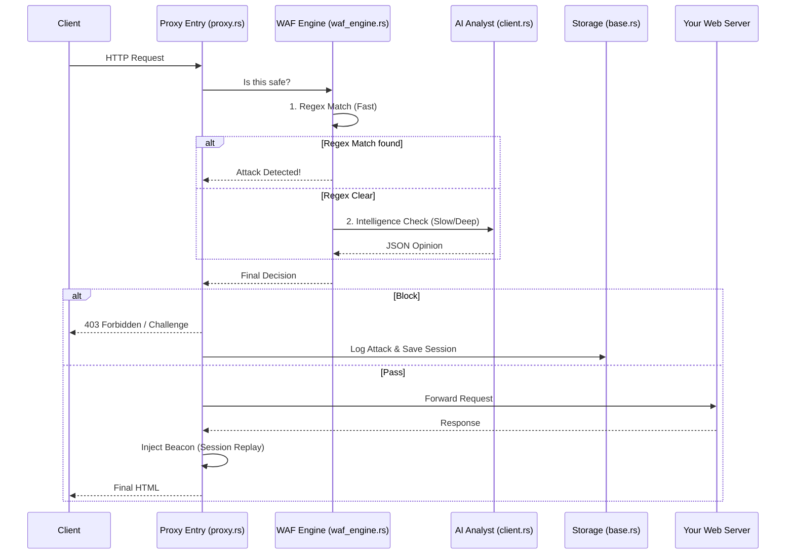

# 🛠️ Biubo WAF Developer Guide

Welcome to the internal world of Biubo WAF! This document is designed for developers who want to understand the architecture, contribute code, or customize the engine.

## 🏗️ System Architecture

Biubo WAF is built with a **Reverse Proxy First** philosophy. It sits at the edge of your network, acting as a gatekeeper.

## 🧩 Core Modules

| Module | Location | Description |
| :--- | :--- | :--- |
| **Proxy Gateway** | `src/api/routes/proxy.rs` | Handles all routing, rate limiting, and JS challenges. |
| **WAF Engine** | `src/core/engine/waf_engine.rs` | The "brain". Implements the two-layer (Regex + AI) detection. |
| **Storage Engine** | `src/data/storage/base.rs` | A high-performance, key-value store using Msgpack with write-behind flushing. |
| **Protocol Logic** | `src/services/proxy/forwarder.rs` | Manages the connection to backend servers. |
| **Session Replay** | `src/core/session/manager.rs` | Captures rrweb snapshots for visual debugging. |

## 🧠 LLM Logic (The "Soul")

The LLM detection isn't just a simple prompt. We provide the AI with:
1.  **Request Context**: URL, Headers, Body, Cookies.
2.  **Historical Context**: The last 5 requests from the same IP (to detect sequential probing).
3.  **Intent Guidance**: We instruct the AI to look for *Hacker Intent* vs *Admin Purpose*.

## 💾 Storage Strategy

We avoid heavy dependencies like MySQL or Redis in the first release.
- **RAM.msgpack**: Stores real-time config, blacklists, and whitelists.
- **Logs/{Date}.msgpack**: Stores daily traffic data and rrweb sessions.
- **Write-Behind**: All writes are staged in RAM and flushed to disk every second to prevent I/O blocking.

## 🚧 Areas for Contribution (The "Low Hanging Fruit")

If you want to contribute, here are some great places to start:
1.  **Performance Optimization**: Implement an asynchronous LLM queue so we don't block requests.
2.  **Dockerization**: Help us build a modular Dockerfile.
3.  **UI/UX**: Enhance the Dashboard visuals (built with plain JS/HTML).
4.  **Rule Sets**: Expand the regex rules in `src/core/engine/rules.rs` based on recent CVEs.

---
Built with ❤️ for a safer web.
