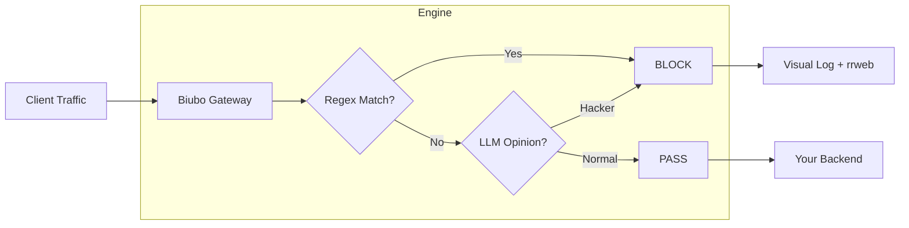

# 🛡️ Biubo WAF

<p align="center">
  
  <br>
  
  
  
  
  
  <br>
  <b>A Web Application Firewall that Thinks, Remembers, and Visualizes.</b>
</p>

---

## ⚡ What is Biubo WAF?

**Biubo WAF** is not just another rule-based filter. It is an **Intelligence-First Proxy** that bridges the gap between high-speed security and modern AI intuition. It sits as a guardian in front of your applications, watching every request through a dual lens of **Regex Performance** and **LLM Awareness**.

> [!TIP]
> **Zero-Zero Setup**: No SQL, No Redis, No complex Nginx configs. Just Rust and the power of AI.

---

## 🎬 See it in Action

### 1. 🧠 Intelligence You Can Trust
Biubo WAF monitors every packet. From complex obfuscated payloads to sudden anomalies, watch it neutralize threats in milliseconds before they even reach your server.
> ****
> *Attack detected and IP instantly isolated using high-speed signature and semantic correlation.*

### 2. 🎥 Visual Forensics (The "DVR" for Security)
Stop guessing. Watch exactly what the attacker did on your site with our integrated `rrweb` session playback.
> ****

### 🗺️ 3. Real-time Attack Visualization
Stay ahead of the threat. Visualize every incoming attack on a live global map, providing instant situational awareness.
> ****

---

## ✨ Key Features

| Feature | Description | Status |
| :--- | :--- | :--- |
| **Dual-Path Detection** | Regex (Fast Path) + LLM (Deep Path) for maximum coverage. | ✅ |
| **Visual Session Replay** | Integrated `rrweb` to record and playback malicious sessions. | ✅ |
| **JS Challenge** | Client-side Challenge-Response to stop headless bots. | ✅ |
| **Self-Contained DB** | Lightning-fast Msgpack storage with write-behind flushing. | ✅ |
| **Dynamic Dashboard** | Modern, responsive console for real-time traffic monitoring. | ✅ |

---

## 🧱 Architecture & Flow



---

## 🚀 Quick Start

### Installation

#### Windows
```powershell
# Using ZIP (portable)
Expand-Archive -Path biubo-waf-*-x86_64*.zip -DestinationPath C:\BiuboWAF
cd C:\BiuboWAF
.\biubo-waf.exe

# Using MSI installer (recommended)
msiexec /i biubo-waf-*-x86_64*.msi
```

#### Ubuntu/Debian (APT)
```bash
# x86_64
sudo dpkg -i biubo-waf-*-x86_64*.deb
sudo apt-get install -f

# ARM64 (Raspberry Pi, AWS Graviton)
sudo dpkg -i biubo-waf-*-aarch64*.deb
sudo apt-get install -f

# Start service
sudo systemctl enable --now biubo-waf
```

#### CentOS/RHEL/Fedora (YUM/DNF)
```bash
# Using YUM
sudo yum install biubo-waf-*-x86_64*.rpm

# Using DNF (Fedora/RHEL 8+)
sudo dnf install biubo-waf-*-x86_64*.rpm

# ARM64
sudo yum install biubo-waf-*-aarch64*.rpm

# Start service
sudo systemctl enable --now biubo-waf
```

#### Loongnix/UOS (龙芯架构)
```bash
# Install DEB package (Loongnix)
sudo dpkg -i biubo-waf-*-loongarch64*.deb

# Or install RPM package (UOS)
sudo yum install biubo-waf-*-loongarch64*.rpm

# Start service
sudo systemctl enable --now biubo-waf
```

#### macOS (DMG)
```bash
# Intel (x86_64)
hdiutil attach biubo-waf-*-x86_64*.dmg
cp /Volumes/Biubo\ WAF/biubo-waf /usr/local/bin/
hdiutil detach /Volumes/Biubo\ WAF

# Apple Silicon (ARM64)
hdiutil attach biubo-waf-*-aarch64*.dmg
cp /Volumes/Biubo\ WAF/biubo-waf /usr/local/bin/
hdiutil detach /Volumes/Biubo\ WAF

# Run
biubo-waf
```

### Supported Architectures

| Platform | Architecture | Package Formats |
|----------|--------------|-----------------|
| Windows | x86_64 | ZIP, MSI |
| Windows | ARM64 | ZIP |
| Ubuntu/Debian | x86_64 | TAR.GZ, DEB |
| Ubuntu/Debian | ARM64 | TAR.GZ, DEB |
| CentOS/RHEL/Fedora | x86_64 | TAR.GZ, RPM (YUM/DNF) |
| CentOS/RHEL/Fedora | ARM64 | TAR.GZ, RPM (YUM/DNF) |
| Loongnix/UOS (龙芯) | LoongArch64 | TAR.GZ, DEB, RPM |
| macOS (Intel) | x86_64 | TAR.GZ, DMG |
| macOS (Apple Silicon) | ARM64 | TAR.GZ, DMG |

### Build from Source
```bash
# Clone the repository
git clone https://github.com/mc-yzy15/Biubo-rust.git
cd Biubo-rust

# Build (requires Rust 1.75+)
cargo build --release

# Start protecting
cargo run --release
```

### Docker Deployment
```bash
docker run zplb/biubo:1.1.0
```

---

## 📑 Documentation Links

-   [**Developer Guide**](DEVELOPER.md) - How the engine works internally.
-   [**Roadmap**](ROADMAP.md) - Our vision for P1/P2/P3.
-   [**Contributing**](CONTRIBUTING.md) - We need your code and ideas!

---

## 📄 License

Biubo WAF is open-source software licensed under the **MIT License**.

<p align="center">
  Built with ❤️ for a more secure, intelligent web.
</p>
