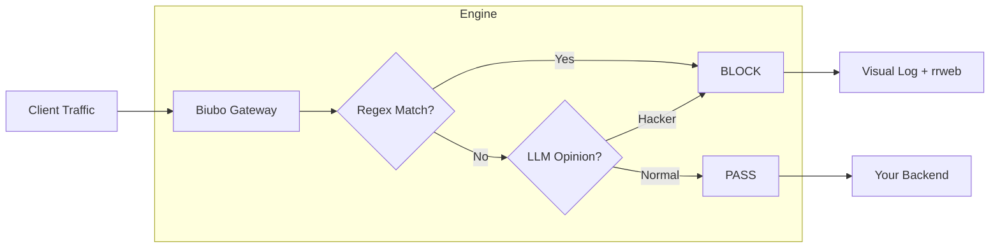
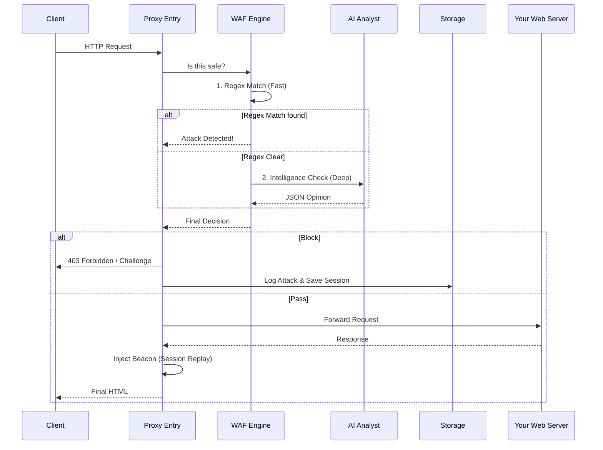

# 🛡️ Biubo WAF

<p align="center">
  
  <br>
  
  
  
  
  
  <br>
  <b>A Web Application Firewall that Thinks, Remembers, and Visualizes.</b>
</p>

---

## ⚡ What is Biubo WAF?

**Biubo WAF** is an **Intelligence-First Reverse Proxy** that bridges the gap between high-speed security and modern AI intuition. It sits as a guardian in front of your applications, watching every request through a dual lens of **Regex Performance** and **LLM Awareness**.

Unlike traditional WAFs that rely solely on static rules, Biubo WAF combines:
- **Lightning-fast regex matching** for known attack patterns
- **AI-powered semantic analysis** for zero-day threats and obfuscated payloads
- **Visual session replay** to see exactly what attackers did
- **Real-time global attack map** for situational awareness

> [!TIP]
> **Zero-Zero Setup**: No SQL, No Redis, No complex Nginx configs. Just Rust and the power of AI.

---

## 🎬 See it in Action

### 1. 🧠 Intelligence You Can Trust
Biubo WAF monitors every packet. From complex obfuscated payloads to sudden anomalies, watch it neutralize threats in milliseconds before they even reach your server.

<p align="center">
  
  <br>
  <i>Attack detected and IP instantly isolated using high-speed signature and semantic correlation.</i>
</p>

### 2. 🎥 Visual Forensics (The "DVR" for Security)
Stop guessing. Watch exactly what the attacker did on your site with our integrated `rrweb` session playback.

<p align="center">
  
</p>

### 3. 🗺️ Real-time Attack Visualization
Stay ahead of the threat. Visualize every incoming attack on a live global map, providing instant situational awareness.

<p align="center">
  
</p>

---

## ✨ Key Features

| Feature | Description | Status |
| :--- | :--- | :--- |
| **Dual-Path Detection** | Regex (Fast Path) + LLM (Deep Path) for maximum coverage. | ✅ |
| **Visual Session Replay** | Integrated `rrweb` to record and playback malicious sessions. | ✅ |
| **JS Challenge** | Client-side Challenge-Response to stop headless bots. | ✅ |
| **Self-Contained DB** | Lightning-fast Msgpack storage with write-behind flushing. | ✅ |
| **Dynamic Dashboard** | Modern, responsive console for real-time traffic monitoring. | ✅ |
| **Rate Limiting** | Per-IP rate limiting with configurable thresholds. | ✅ |
| **IP Black/Whitelist** | Manual IP management with persistent storage. | ✅ |
| **Multi-Host Support** | Proxy multiple backend services with different rules. | ✅ |
| **Global Attack Map** | Real-time 3D globe visualization of attack sources. | ✅ |
| **System Monitoring** | Live CPU, memory, and network stats. | ✅ |
| **Multi-Arch Support** | Windows, Linux (x86_64/ARM64/LoongArch), macOS (Intel/Apple Silicon). | ✅ |
| **i18n Support** | Built-in English and Chinese localization. | ✅ |

---

## 🛠️ Tech Stack

### Backend (Rust)
- **Web Framework**: [Axum](https://github.com/tokio-rs/axum) 0.8 + Tokio async runtime
- **HTTP Client**: [reqwest](https://github.com/seanmonstar/reqwest) with rustls-tls
- **Storage**: Custom Msgpack-based key-value store with write-behind flushing
- **Concurrency**: DashMap, parking_lot for high-performance concurrent access
- **Logging**: tracing + tracing-subscriber with JSON output

### Frontend (TypeScript)
- **Framework**: React 18 + TypeScript
- **Build Tool**: Vite 6
- **i18n**: i18next + react-i18next
- **Styling**: Custom CSS with responsive design

---

## ⚙️ Configuration

Biubo WAF uses a file-based configuration system. Configuration files are stored in the `data/` directory:

| File | Description |
| :--- | :--- |
| `data/RAM.msgpack` | Real-time config, blacklists, whitelists |
| `data/logs/` | Daily traffic logs and rrweb sessions |

### Default Settings
- **WAF Port**: `8080` (configurable via `WAF_PORT` env var)
- **Dashboard**: Access at `http://localhost:8080/dashboard`
- **Log Level**: `info` (configurable via `RUST_LOG` env var)

### Environment Variables
| Variable | Description | Default |
| :--- | :--- | :--- |
| `WAF_PORT` | Port for the WAF proxy | `8080` |
| `RUST_LOG` | Logging level | `info` |

---

## 🏗️ Architecture & Flow

### High-Level Architecture


```mermaid
graph LR
    A[Client Traffic] --> B[Biubo Gateway]
    subgraph Engine
        B --> C{Regex Match?}
        C -- No --> D{LLM Opinion?}
        D -- Hacker --> E[BLOCK]
        C -- Yes --> E
        D -- Normal --> F[PASS]
    end
    F --> G[Your Backend]
    E --> H[Visual Log + rrweb]
```

### Request Flow


```mermaid
sequenceDiagram
    participant Client
    participant Proxy as Proxy Entry
    participant Engine as WAF Engine
    participant LLM as AI Analyst
    participant DB as Storage
    participant Backend as Your Web Server

    Client->>Proxy: HTTP Request
    Proxy->>Engine: Is this safe?
    Engine->>Engine: 1. Regex Match (Fast)
    alt Regex Match found
        Engine-->>Proxy: Attack Detected!
    else Regex Clear
        Engine->>LLM: 2. Intelligence Check (Deep)
        LLM-->>Engine: JSON Opinion
    end
    Engine-->>Proxy: Final Decision
    
    alt Block
        Proxy-->>Client: 403 Forbidden / Challenge
        Proxy->>DB: Log Attack & Save Session
    else Pass
        Proxy->>Backend: Forward Request
        Backend-->>Proxy: Response
        Proxy->>Proxy: Inject Beacon (Session Replay)
        Proxy-->>Client: Final HTML
    end
```

---

## 📁 Project Structure

```
Biubo-rust/
├── src/
│   ├── api/              # HTTP API routes (Axum)
│   │   ├── routes/       # Dashboard, proxy, init handlers
│   │   └── app.rs        # App builder
│   ├── config/           # Configuration management
│   ├── core/             # Core WAF logic
│   │   ├── engine/       # Detection engine (Regex + LLM)
│   │   ├── security/     # JS challenge, rate limiting
│   │   └── session/      # Session management & GC
│   ├── data/             # Data layer
│   │   ├── analytics/    # Traffic aggregation & stats
│   │   └── storage/      # Msgpack-based storage engine
│   ├── services/         # External services
│   │   ├── llm/          # LLM client & integration
│   │   └── proxy/        # Backend forwarding logic
│   └── utils/            # Utilities (compression, parsers)
├── frontend/             # React + TypeScript dashboard
├── page/                 # Built frontend assets (served by WAF)
├── templates/            # HTML templates & JS beacons
├── systemd/              # systemd service file
├── debian/               # Debian package scripts
├── rpm/                  # RPM package spec
└── wix/                  # Windows MSI installer (WiX)
```

---

## 🚀 Quick Start

### Prerequisites

- **Rust**: 1.75 or higher
- **OS**: Windows, Linux, or macOS
- **RAM**: 256MB minimum (scales with traffic)
- **LLM API Key**: OpenAI-compatible API (optional, for AI detection)

### Installation

#### Option 1: Build from Source (Recommended)

```bash
# Clone the repository
git clone https://github.com/mc-yzy15/Biubo-rust.git
cd Biubo-rust

# Build in release mode
cargo build --release

# Run the WAF
cargo run --release
```

#### Option 2: Docker Deployment

```bash
docker run -d \
  --name biubo-waf \
  -p 8080:8080 \
  -v $(pwd)/config:/etc/biubo-waf \
  -v $(pwd)/data:/var/lib/biubo-waf \
  zplb/biubo:1.1.0
```

#### Option 3: Pre-built Binaries

##### Windows
```powershell
# Using ZIP (portable)
Expand-Archive -Path biubo-waf-*-x86_64*.zip -DestinationPath C:\BiuboWAF
cd C:\BiuboWAF
.\biubo-waf.exe

# Using MSI installer (recommended)
msiexec /i biubo-waf-*-x86_64*.msi
```

##### Ubuntu/Debian
```bash
# x86_64
sudo dpkg -i biubo-waf-*-x86_64*.deb
sudo apt-get install -f

# ARM64 (Raspberry Pi, AWS Graviton)
sudo dpkg -i biubo-waf-*-aarch64*.deb
sudo apt-get install -f

# Start service
sudo systemctl enable --now biubo-waf
```

##### CentOS/RHEL/Fedora
```bash
# Using YUM
sudo yum install biubo-waf-*-x86_64*.rpm

# Using DNF (Fedora/RHEL 8+)
sudo dnf install biubo-waf-*-x86_64*.rpm

# Start service
sudo systemctl enable --now biubo-waf
```

##### macOS
```bash
# Intel (x86_64)
hdiutil attach biubo-waf-*-x86_64*.dmg
cp /Volumes/Biubo\ WAF/biubo-waf /usr/local/bin/
hdiutil detach /Volumes/Biubo\ WAF

# Apple Silicon (ARM64)
hdiutil attach biubo-waf-*-aarch64*.dmg
cp /Volumes/Biubo\ WAF/biubo-waf /usr/local/bin/
hdiutil detach /Volumes/Biubo\ WAF

# Run
biubo-waf
```

### Supported Platforms

| Platform | Architecture | Package Formats |
|----------|--------------|-----------------|
| Windows | x86_64, ARM64 | ZIP, MSI |
| Ubuntu/Debian | x86_64, ARM64 | TAR.GZ, DEB |
| CentOS/RHEL/Fedora | x86_64, ARM64 | TAR.GZ, RPM |
| Loongnix/UOS | LoongArch64 | TAR.GZ, DEB, RPM |
| macOS | x86_64, ARM64 | TAR.GZ, DMG |

---

## ⚙️ Configuration

### Basic Configuration

Biubo WAF uses a simple configuration system. Create a `config.json` in the working directory:

```json
{
  "waf_port": 8080,
  "dashboard_port": 3000,
  "proxy_map": {
    "example.com": "http://localhost:3001",
    "api.example.com": "http://localhost:3002"
  },
  "llm_config": {
    "api_key": "your-openai-api-key",
    "base_url": "https://api.openai.com/v1",
    "model": "gpt-4o-mini",
    "enabled": true
  },
  "session_timeout": 1800,
  "session_gc_interval": 300,
  "cache_ttl": 600,
  "cache_gc_interval": 120,
  "rate_gc_interval": 300
}
```

### Configuration Options

| Option | Type | Default | Description |
|--------|------|---------|-------------|
| `waf_port` | Integer | 8080 | Port for the WAF proxy |
| `dashboard_port` | Integer | 3000 | Port for the admin dashboard |
| `proxy_map` | Object | `{}` | Map of hostnames to backend URLs |
| `llm_config.api_key` | String | `""` | OpenAI-compatible API key |
| `llm_config.base_url` | String | OpenAI URL | Custom LLM API endpoint |
| `llm_config.model` | String | `gpt-4o-mini` | LLM model to use |
| `llm_config.enabled` | Boolean | `false` | Enable AI detection |
| `session_timeout` | Integer | 1800 | Session timeout in seconds |
| `session_gc_interval` | Integer | 300 | Session GC interval in seconds |
| `cache_ttl` | Integer | 600 | Cache time-to-live in seconds |
| `cache_gc_interval` | Integer | 120 | Cache GC interval in seconds |
| `rate_gc_interval` | Integer | 300 | Rate limit GC interval in seconds |

### Environment Variables

You can also configure Biubo WAF using environment variables:

```bash
# Set WAF port
export BIUBO_WAF_PORT=8080

# Set LLM API Key
export BIUBO_LLM_API_KEY=your-api-key

# Set LLM Model
export BIUBO_LLM_MODEL=gpt-4o-mini

# Enable/Disable LLM
export BIUBO_LLM_ENABLED=true

# Set log level (trace, debug, info, warn, error)
export RUST_LOG=info
```

---

## 📖 Usage Guide

### Step 1: Configure Your Backend

Edit the `proxy_map` in your configuration to point to your backend services:

```json
{
  "proxy_map": {
    "myapp.com": "http://localhost:3001",
    "api.myapp.com": "http://localhost:3002"
  }
}
```

### Step 2: Start Biubo WAF

```bash
cargo run --release
```

You should see output like:
```
INFO Starting Biubo WAF Protective Proxy (Rust Edition)...
INFO Serving on host 0.0.0.0, port 8080...
INFO Background GC workers started
```

### Step 3: Access the Dashboard

Open your browser and navigate to `http://localhost:3000` to access the admin dashboard.

### Step 4: Configure LLM (Optional)

For AI-powered detection, configure your LLM provider in the dashboard or configuration file.

---

## 🧪 Testing

### Test Basic Protection

```bash
# Test SQL Injection detection
curl -H "Host: myapp.com" "http://localhost:8080/?id=1' OR '1'='1"

# Test XSS detection
curl -H "Host: myapp.com" "http://localhost:8080/?q=<script>alert('xss')</script>"

# Test normal request
curl -H "Host: myapp.com" "http://localhost:8080/"
```

### Test JS Challenge

```bash
# Simulate a bot request (no JavaScript support)
curl -H "Host: myapp.com" -A "python-requests/2.28.0" "http://localhost:8080/"
```

---

## 📊 Dashboard Features

### 1. Dashboard Tab
- Real-time request statistics
- Attack type distribution
- Recent attack logs
- System health metrics

### 2. Globe Tab
- 3D global attack map
- Country-level statistics
- Attack type breakdown
- IP search functionality

### 3. IP Manager Tab
- Blacklist management
- Whitelist management
- IP ban/unban operations

### 4. Settings Tab
- Basic configuration
- LLM provider settings
- Proxy host management

### 5. System Tab
- CPU and memory usage
- Network statistics
- WAF status control
- System information

---

## 🛠️ Tech Stack

| Component | Technology |
|-----------|------------|
| **Core Language** | Rust 2021 Edition |
| **Web Framework** | Axum 0.8 |
| **Async Runtime** | Tokio |
| **HTTP Client** | Reqwest (rustls) |
| **Storage** | Msgpack (rmp-serde) |
| **Concurrency** | DashMap, Parking Lot |
| **Logging** | Tracing + tracing-subscriber |
| **Frontend** | React + TypeScript + Vite |
| **UI Components** | Custom components |
| **3D Globe** | Three.js + Globe.gl |
| **Session Replay** | rrweb |

---

## 📁 Project Structure

```
Biubo-rust/
├── src/
│   ├── main.rs                 # Application entry point
│   ├── api/                    # HTTP API layer
│   │   ├── app.rs              # App builder
│   │   └── routes/
│   │       ├── dashboard.rs    # Dashboard API
│   │       ├── proxy.rs        # Proxy routing
│   │       ├── init.rs         # Initialization API
│   │       └── internal.rs     # Internal API
│   ├── config/                 # Configuration
│   │   ├── mod.rs
│   │   └── settings.rs         # Settings loader
│   ├── core/                   # Core WAF logic
│   │   ├── engine/
│   │   │   ├── waf_engine.rs   # Detection engine
│   │   │   └── rules.rs        # Detection rules
│   │   ├── security/
│   │   │   ├── challenge.rs    # JS challenge
│   │   │   └── rate_limit.rs   # Rate limiting
│   │   └── session/
│   │       └── manager.rs      # Session management
│   ├── data/                   # Data layer
│   │   ├── storage/
│   │   │   ├── base.rs         # Storage engine
│   │   │   └── manager.rs      # Storage manager
│   │   └── analytics/
│   │       └── aggregator.rs   # Analytics aggregation
│   ├── services/               # External services
│   │   ├── llm/
│   │   │   └── client.rs       # LLM client
│   │   └── proxy/
│   │       └── forwarder.rs    # Backend forwarder
│   └── utils/                  # Utilities
│       ├── http_utils.rs       # HTTP utilities
│       ├── ua_parser.rs        # User-Agent parser
│       └── query_parser.rs     # Query parser
├── frontend/                   # React dashboard
│   ├── src/
│   │   ├── components/         # UI components
│   │   ├── api/                # API client
│   │   ├── hooks/              # React hooks
│   │   ├── i18n/               # Internationalization
│   │   └── types/              # TypeScript types
│   └── package.json
├── page/                       # Static error pages
├── templates/                  # HTML templates
├── systemd/                    # Systemd service file
├── debian/                     # Debian package scripts
├── rpm/                        # RPM spec file
├── wix/                        # Windows installer
└── Cargo.toml                  # Rust dependencies
```

---

## 🤝 Contributing

We welcome contributions! Please see our [Contributing Guide](CONTRIBUTING.md) for details.

### Development Setup

```bash
# Clone the repository
git clone https://github.com/mc-yzy15/Biubo-rust.git
cd Biubo-rust

# Install Rust (if not installed)
curl --proto '=https' --tlsv1.2 -sSf https://sh.rustup.rs | sh

# Build the project
cargo build

# Run tests
cargo test

# Run with debug logging
RUST_LOG=debug cargo run

# Build frontend dashboard
cd frontend
npm install
npm run dev
```

### Code Style

We follow the official Rust style guidelines. Please run `cargo fmt` before submitting PRs:

```bash
cargo fmt --all
cargo clippy --all-targets --all-features -- -D warnings
```

---

## ❓ FAQ

### Q: Do I need an LLM API key to use Biubo WAF?

No. Biubo WAF works with regex-based detection out of the box. The LLM integration is optional and provides additional protection against zero-day threats.

### Q: How does the dual-path detection work?

1. **Fast Path (Regex)**: Every request is first checked against a set of optimized regex rules. This catches 90%+ of common attacks with minimal latency.
2. **Deep Path (LLM)**: If the regex check passes, suspicious requests are sent to the LLM for semantic analysis. The AI looks for intent, context, and obfuscated payloads.

### Q: Can I use Biubo WAF with Docker?

Yes! We provide official Docker images. See the [Docker Deployment](#option-2-docker-deployment) section above.

### Q: How do I customize the detection rules?

You can modify the rules in `src/core/engine/rules.rs` or manage them through the dashboard's IP blacklist/whitelist features.

### Q: Is session replay privacy-compliant?

Session replay only captures requests that are flagged as malicious. Normal user traffic is not recorded. You can disable session replay in the configuration.

### Q: What happens if the LLM service is down?

Biubo WAF gracefully handles LLM failures. If the LLM is unavailable, the WAF falls back to regex-only detection mode.

### Q: How much memory does Biubo WAF use?

Biubo WAF is designed to be lightweight. Base memory usage is around 50-100MB, scaling with traffic volume and session count.

### Q: Can I use a custom LLM provider?

Yes! Biubo WAF supports any OpenAI-compatible API. Simply set the `base_url` in the LLM configuration to your provider's endpoint.

---

## 📚 Documentation

- [**Developer Guide**](DEVELOPER.md) - Deep dive into the architecture and internals
- [**Roadmap**](ROADMAP.md) - Our vision and upcoming features (P1/P2/P3)
- [**Contributing**](CONTRIBUTING.md) - How to contribute code and ideas

---

## 📄 License

Biubo WAF is open-source software licensed under the **MIT License**.

```
MIT License

Copyright (c) 2024 mc-yzy15

Permission is hereby granted, free of charge, to any person obtaining a copy
of this software and associated documentation files (the "Software"), to deal
in the Software without restriction, including without limitation the rights
to use, copy, modify, merge, publish, distribute, sublicense, and/or sell
copies of the Software, and to permit persons to whom the Software is
furnished to do so, subject to the following conditions:

The above copyright notice and this permission notice shall be included in all
copies or substantial portions of the Software.
```

---

<p align="center">
  Built with ❤️ by <a href="https://github.com/mc-yzy15">mc-yzy15</a> for a more secure, intelligent web.
</p>

<p align="center">
  <a href="https://github.com/mc-yzy15">GitHub</a> •
  <a href="https://space.bilibili.com/1338637552">Bilibili</a> •
  <a href="https://blog.csdn.net/m0_68339835">CSDN</a> •
  <a href="https://t.me/+1nZnaWWryz1kNDll">Telegram Group</a>
</p>
