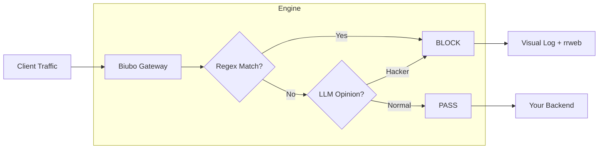

# 🛡️ Biubo WAF

<p align="center">
  
  <br>
  
  
  
  
  
  <br>
  <b>A Web Application Firewall that Thinks, Remembers, and Visualizes.</b>
</p>

---

## ⚡ What is Biubo WAF?

**Biubo WAF** is not just another rule-based filter. It is an **Intelligence-First Proxy** that bridges the gap between high-speed security and modern AI intuition. It sits as a guardian in front of your applications, watching every request through a dual lens of **Regex Performance** and **LLM Awareness**.

> [!TIP]
> **Zero-Zero Setup**: No SQL, No Redis, No complex Nginx configs. Just Rust and the power of AI.

---

## 🎬 See it in Action

### 1. 🧠 Intelligence You Can Trust

Biubo WAF monitors every packet. From complex obfuscated payloads to sudden anomalies, watch it neutralize threats in milliseconds before they even reach your server.

> ****
> _Attack detected and IP instantly isolated using high-speed signature and semantic correlation._

### 2. 🎥 Visual Forensics (The "DVR" for Security)

Stop guessing. Watch exactly what the attacker did on your site with our integrated `rrweb` session playback.

> ****

### 🗺️ 3. Real-time Attack Visualization

Stay ahead of the threat. Visualize every incoming attack on a live global map, providing instant situational awareness.

> ****

---

## ✨ Key Features

| Feature                   | Description                                                           | Status |
| :------------------------ | :-------------------------------------------------------------------- | :----- |
| **Dual-Path Detection**   | Regex (Fast Path) + LLM (Deep Path) for maximum coverage.             | ✅     |
| **Visual Session Replay** | Integrated `rrweb` to record and playback malicious sessions.         | ✅     |
| **JS Challenge**          | Client-side Challenge-Response to stop headless bots.                 | ✅     |
| **Self-Contained DB**     | Lightning-fast Msgpack storage with write-behind flushing.            | ✅     |
| **Dynamic Dashboard**     | Modern, responsive console for real-time traffic monitoring.          | ✅     |
| **Global Attack Map**     | Real-time 3D globe visualization of attack sources.                   | ✅     |
| **Multi-Arch Support**    | Windows, Linux (x86_64/ARM64/LoongArch), macOS (Intel/Apple Silicon). | ✅     |
| **i18n Support**          | Built-in English and Chinese localization.                            | ✅     |

---

## 🛠️ Tech Stack

### Backend (Rust)

- **Web Framework**: [Axum](https://github.com/tokio-rs/axum) 0.8 + Tokio async runtime
- **HTTP Client**: [reqwest](https://github.com/seanmonstar/reqwest) with rustls-tls
- **Storage**: Custom Msgpack-based key-value store with write-behind flushing
- **Concurrency**: DashMap, parking_lot for high-performance concurrent access
- **Logging**: tracing + tracing-subscriber with JSON output

### Frontend (TypeScript)

- **Framework**: React 18 + TypeScript
- **Build Tool**: Vite 6
- **i18n**: i18next + react-i18next
- **Styling**: Custom CSS with responsive design

---

## ⚙️ Configuration

Biubo WAF uses a file-based configuration system. Configuration files are stored in the `data/` directory:

| File               | Description                              |
| :----------------- | :--------------------------------------- |
| `data/RAM.msgpack` | Real-time config, blacklists, whitelists |
| `data/logs/`       | Daily traffic logs and rrweb sessions    |

### Default Settings

- **WAF Port**: `8080` (configurable via `WAF_PORT` env var)
- **Dashboard**: Access at `http://localhost:8080/dashboard`
- **Log Level**: `info` (configurable via `RUST_LOG` env var)

### Environment Variables

| Variable   | Description            | Default |
| :--------- | :--------------------- | :------ |
| `WAF_PORT` | Port for the WAF proxy | `8080`  |
| `RUST_LOG` | Logging level          | `info`  |

---

## 🧱 Architecture & Flow


```mermaid
graph LR
    A[Client Traffic] --> B[Biubo Gateway]
    subgraph Engine
        B --> C{Regex Match?}
        C -- No --> D{LLM Opinion?}
        D -- Hacker --> E[BLOCK]
        C -- Yes --> E
        D -- Normal --> F[PASS]
    end
    F --> G[Your Backend]
    E --> H[Visual Log + rrweb]
```

---

## 📁 Project Structure

```
Biubo-rust/
├── src/
│   ├── api/              # HTTP API routes (Axum)
│   │   ├── routes/       # Dashboard, proxy, init handlers
│   │   └── app.rs        # App builder
│   ├── config/           # Configuration management
│   ├── core/             # Core WAF logic
│   │   ├── engine/       # Detection engine (Regex + LLM)
│   │   ├── security/     # JS challenge, rate limiting
│   │   └── session/      # Session management & GC
│   ├── data/             # Data layer
│   │   ├── analytics/    # Traffic aggregation & stats
│   │   └── storage/      # Msgpack-based storage engine
│   ├── services/         # External services
│   │   ├── llm/          # LLM client & integration
│   │   └── proxy/        # Backend forwarding logic
│   └── utils/            # Utilities (compression, parsers)
├── frontend/             # React + TypeScript dashboard
├── page/                 # Built frontend assets (served by WAF)
├── templates/            # HTML templates & JS beacons
├── systemd/              # systemd service file
├── debian/               # Debian package scripts
├── rpm/                  # RPM package spec
└── wix/                  # Windows MSI installer (WiX)
```

---

## 🚀 Quick Start

### Installation

#### Windows

```powershell
# Using ZIP (portable)
Expand-Archive -Path biubo-waf-*-x86_64*.zip -DestinationPath C:\BiuboWAF
cd C:\BiuboWAF
.\biubo-waf.exe

# Using MSI installer (recommended)
msiexec /i biubo-waf-*-x86_64*.msi
```

#### Ubuntu/Debian (APT)

```bash
# x86_64
sudo dpkg -i biubo-waf-*-x86_64*.deb
sudo apt-get install -f

# ARM64 (Raspberry Pi, AWS Graviton)
sudo dpkg -i biubo-waf-*-aarch64*.deb
sudo apt-get install -f

# Start service
sudo systemctl enable --now biubo-waf
```

#### CentOS/RHEL/Fedora (YUM/DNF)

```bash
# Using YUM
sudo yum install biubo-waf-*-x86_64*.rpm

# Using DNF (Fedora/RHEL 8+)
sudo dnf install biubo-waf-*-x86_64*.rpm

# ARM64
sudo yum install biubo-waf-*-aarch64*.rpm

# Start service
sudo systemctl enable --now biubo-waf
```

#### Loongnix/UOS (龙芯架构)

```bash
# Install DEB package (Loongnix)
sudo dpkg -i biubo-waf-*-loongarch64*.deb

# Or install RPM package (UOS)
sudo yum install biubo-waf-*-loongarch64*.rpm

# Start service
sudo systemctl enable --now biubo-waf
```

#### macOS (DMG)

```bash
# Intel (x86_64)
hdiutil attach biubo-waf-*-x86_64*.dmg
cp /Volumes/Biubo\ WAF/biubo-waf /usr/local/bin/
hdiutil detach /Volumes/Biubo\ WAF

# Apple Silicon (ARM64)
hdiutil attach biubo-waf-*-aarch64*.dmg
cp /Volumes/Biubo\ WAF/biubo-waf /usr/local/bin/
hdiutil detach /Volumes/Biubo\ WAF

# Run
biubo-waf
```

### Supported Architectures

| Platform              | Architecture | Package Formats       |
| --------------------- | ------------ | --------------------- |
| Windows               | x86_64       | ZIP, MSI              |
| Windows               | ARM64        | ZIP                   |
| Ubuntu/Debian         | x86_64       | TAR.GZ, DEB           |
| Ubuntu/Debian         | ARM64        | TAR.GZ, DEB           |
| CentOS/RHEL/Fedora    | x86_64       | TAR.GZ, RPM (YUM/DNF) |
| CentOS/RHEL/Fedora    | ARM64        | TAR.GZ, RPM (YUM/DNF) |
| Loongnix/UOS (龙芯)   | LoongArch64  | TAR.GZ, DEB, RPM      |
| macOS (Intel)         | x86_64       | TAR.GZ, DMG           |
| macOS (Apple Silicon) | ARM64        | TAR.GZ, DMG           |

### Build from Source

```bash
# Clone the repository
git clone https://github.com/mc-yzy15/Biubo-rust.git
cd Biubo-rust

# Build (requires Rust 1.75+)
cargo build --release

# Start protecting
cargo run --release
```

### Docker Deployment

```bash
# Run with default settings
docker run -p 8080:8080 zplb/biubo:1.1.0

# Run with custom port and config volume
docker run -d \
  -p 8080:8080 \
  -v $(pwd)/data:/app/data \
  -e RUST_LOG=debug \
  zplb/biubo:1.1.0
```

---

## 📑 Documentation Links

- [**Developer Guide**](DEVELOPER.md) - How the engine works internally.
- [**Roadmap**](ROADMAP.md) - Our vision for P1/P2/P3.
- [**Contributing**](CONTRIBUTING.md) - We need your code and ideas!

---

## � Acknowledgements

**Biubo WAF (Rust)** is a **Rust-based rewrite and deep refactoring** of the original [**Biubo**](https://github.com/BiuboWAF/Biubo) project by [**@BiuboWAF**](https://github.com/BiuboWAF).

The original project provided the architectural foundation and core design philosophy that inspired this implementation. After thoroughly studying and understanding the original codebase, this version was **rebuilt from the ground up in Rust** — not a line-by-line translation, but a thoughtful, idiomatic re-implementation that leverages Rust's strengths (memory safety, zero-cost abstractions, fearless concurrency) and the modern async ecosystem.

### 🌟 What's new in this Rust edition

| 领域 (Area)          | 增强 (Enhancement)                                                                |
| -------------------- | --------------------------------------------------------------------------------- |
| 🚀 **Runtime**       | Built on **Tokio + Axum** for high-throughput, non-blocking I/O                   |
| 🧠 **Detection**     | **Dual-path engine**: Regex fast-path + LLM deep-path (async queue, non-blocking) |
| 🎬 **Replay**        | First-class **rrweb session replay** with encrypted storage                       |
| 🌍 **Visualization** | Real-time **3D attack map** + rrweb replay viewer dashboard                       |
| 🔌 **Plugins**       | **WASM-style plugin system** with loader, registry, and exporter queue            |
| 🌐 **Cluster**       | Native **cluster mode**: heartbeat, config sync, threat-intel sharing             |
| 🔒 **TLS**           | **Auto-TLS** via `rustls` + ACME (no OpenSSL dependency)                          |
| 💾 **Storage**       | Pluggable storage: msgpack KV → Redis → Postgres, write-behind flush              |
| 🛡️ **Security**      | **JS challenge** + **rate limiter** + **IP reputation** + **behavior profiling**  |
| 🧪 **Testing**       | Comprehensive unit + integration tests (mockito, in-memory backends)              |

### 🤝 Credits

> **Full credit goes to [@BiuboWAF](https://github.com/BiuboWAF) for the original [Biubo](https://github.com/BiuboWAF/Biubo) project.** The architectural vision, the dual-path detection philosophy, and the WAF-first mindset all originated there.
>
> This Rust edition is an **independent re-implementation** that stands on the shoulders of that original work, with substantial new code, new features, and a different technology stack.

If you use or fork this project, please retain attribution to both:

- the **original Biubo project** by `@BiuboWAF`
- this **Rust edition** by `@mc-yzy15`

---

## �📄 License

Biubo WAF is open-source software licensed under the **GNU Affero General Public License v3.0 (AGPL-3.0)**.

Under the AGPL-3.0, you are free to use, modify, and distribute the Software, **provided that** any modified version that you make available over a network must also be released under AGPL-3.0 with its source code disclosed to users interacting with it.

### 🏢 Commercial License — Enterprise Edition (EE)

If your use case **cannot comply with the AGPL-3.0 obligations** (for example: offering Biubo WAF as a closed-source SaaS / managed service, or embedding it into a proprietary product without disclosing your modifications), a **separate Commercial License** is available.

The Commercial License lets you:

- Use Biubo WAF in closed-source / proprietary products
- Offer Biubo WAF as a hosted or managed service **without** source disclosure
- Receive prioritized technical support and SLAs
- Obtain indemnification
- Access Enterprise Edition features: kernel bypass (1.8 Tbps), Hyperscan DFA, local model inference, multi-tenant isolation, and more

#### Edition Comparison

| Feature | Community (OSS) | Trial | Starter | Professional | Enterprise | Ultimate |
|:--------|:----------------|:------|:--------|:-------------|:-----------|:---------|
| **Price** | Free (AGPL-3.0) | Free (30-day) | Subscription S1 | Subscription S2 | Subscription S3 | Subscription S4 / Buyout |
| **Throughput** | 5 Gbps | 5 Gbps | 50 Gbps | 200 Gbps | 1 Tbps | Unlimited (1.8 Tbps+) |
| **Max Tenants** | 1 | 1 | 1 | 10 | 50 | Unlimited |
| **Max Nodes** | 1 | 1 | 3 | 10 | 50 | Unlimited |
| Kernel Bypass (XDP/io_uring) | - | 30-day | Yes | Yes | Yes | Yes |
| Hyperscan DFA Engine | - | 30-day | Yes | Yes | Yes | Yes |
| Local Model Tier 0 (<1ms) | - | - | Yes | Yes | Yes | Yes |
| Local Model Tier 1 (<30ms) | - | - | - | Yes | Yes | Yes |
| Local Model Tier 2 (<100ms) | - | - | - | - | Yes | Yes |
| Local Model Tier 3 (GPU) | - | - | - | - | - | Yes |
| RAG Learning | - | - | - | - | - | Yes |
| Multi-Tenant Isolation | - | - | - | Yes | Yes | Yes |
| RBAC (4 levels) | - | - | - | Yes | Yes | Yes |
| SSO/SAML/OIDC | - | - | - | - | Yes | Yes |
| Audit Log + SLA Reports | - | - | - | Yes | Yes | Yes |
| Data Masking (等保) | - | - | - | - | Yes | Yes |
| Compliance Reports (等保 2.0) | - | - | - | - | Yes | Yes |
| BGP Blackholing | - | - | - | - | Yes | Yes |
| GeoIP | - | - | - | - | Yes | Yes |
| Financial Rule Pack | - | - | - | - | Yes | Yes |
| Gov Compliance Rule Pack | - | - | - | - | Yes | Yes |
| APT Detection Rule Pack | - | - | - | - | - | Yes |
| L4 Anti-DDoS | - | 30-day | Yes | Yes | Yes | Yes |
| LLM Circuit Breaker + Budget | - | 30-day | Yes | Yes | Yes | Yes |
| Streaming + Early Termination | - | 30-day | Yes | Yes | Yes | Yes |
| IPv6 Billion-scale Anti-D | - | - | - | Yes | Yes | Yes |
| Anycast | - | - | - | - | Yes | Yes |
| Custom Rule Pack | - | - | - | - | - | Yes |
| Pay-as-you-go (optional) | - | - | Optional | Optional | Optional | Optional |
| 24x7 SLA | - | - | - | - | Yes | Yes |
| Dedicated Tech Support | - | - | - | - | - | Yes |

#### Extra Paid Features

| Feature | Description | Prerequisite |
|:--------|:------------|:-------------|
| **Local Model Tier 1~3** | Deploy small LLM locally for inference (data never leaves enterprise) | Starter (Tier 0 only) / Professional+ (Tier 0~3) |
| **RAG Learning** | Large model judgments stored in vector DB; small model queries RAG first for <0.1ms response | Ultimate edition |
| **Rule Packs** (finpack/govpack/apt) | Industry-specific detection rules (financial, government, APT) | Enterprise+ (finpack/govpack) / Ultimate (apt) |
| **Pay-as-you-go** | Pay per GB of traffic processed; can stack with subscription | Any paid edition (optional add-on) |

#### Trial Edition

- **Free 30-day full-feature trial** of Enterprise Edition core features
- Auto-downgrades to Community edition after expiry (no service interruption)
- One trial per machine code (anti-abuse)
- Contact us to upgrade after trial

📩 **For commercial licensing, please contact:** [yingmoliuguang@yeah.net](mailto:yingmoliuguang@yeah.net)

See [COMMERCIAL-LICENSE.md](COMMERCIAL-LICENSE.md) for full details.

---

<p align="center">
  <b>Built with ❤️ for a more secure, intelligent web.</b>
  <br><br>
  <sub>Standing on the shoulders of giants — <a href="https://github.com/BiuboWAF/Biubo">the original Biubo</a> by <a href="https://github.com/BiuboWAF">@BiuboWAF</a>.</sub>
</p>
